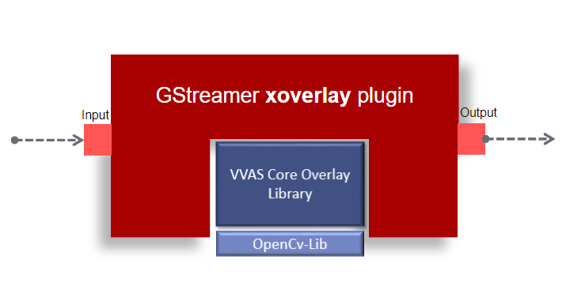

.. _vvas_xoverlay:

vvas_xoverlay
=============

The Overlay plug-in is utilized to draw shapes like bounding boxes, lines, arrows, circles, and polygons on a given frame or image. Users can display a clock on any part of the frame by using the display-clock property. This plug-in employs the ``VVAS Core Overlay`` library to produce different shapes, text, and clocks.

The overlay metadata structure, ``GstVvasOverlayMeta``, must be used to provide the information about the objects like, bounding boxes, lines, and arrows to be drawn. This metadata must be attached to the input buffer. For more details about this overlay metadata structure, please refer :ref:`vvas_overlay_metadata` section.

To convert metadata generated from an upstream plug-in such as ``vvas_xinfer``, ``vvas_xoptflow``, or segmentation into ``GstVvasOverlayMeta``, an intermediate plug-in called :ref:`vvas_xmetaconvert` is provided and this can be used before the ``vvas_xoverlay`` plug-in in gstreamer pipeline.

For implementation details, refer to `vvas_xoverlay source code <https://github.com/Xilinx/VVAS/tree/master/vvas-gst-plugins/sys/overlay>`_

Supported features
-------------------

+--------------+-----------------------------------------------------------------------------------------------+
|              |                                                                                               |
|  **Feature** |                                   **Description**                                             |
|              |                                                                                               |
+==============+===============================================================================================+
|   boxes      | Drawing bounding boxes with and without background color                                      |
|              |                                                                                               |
+--------------+-----------------------------------------------------------------------------------------------+
|   text       | Overlaying of text with and without background color. Supports initial 5 of the Hershey fonts |
|              | in OpenCv (SIMPLEX, PLAIN, DUPLEX, COMPLEX, TRIPLEX).                                         |
+--------------+-----------------------------------------------------------------------------------------------+
|   lines      | For drawing lines with different thickness and color                                          |
|              |                                                                                               |
+--------------+-----------------------------------------------------------------------------------------------+
|   arrows     | Drawing arrows on either side of line or both the sides                                       |
|              |                                                                                               |
+--------------+-----------------------------------------------------------------------------------------------+
|   circle     | For drawing circles of different radius and thickness without fill                            |
|              |                                                                                               |
+--------------+-----------------------------------------------------------------------------------------------+
|   polygons   | For drawing closed polygons without fill                                                      |
|              |                                                                                               |
+--------------+-----------------------------------------------------------------------------------------------+

Input and Output
--------------------

Supported input video formats are RGB, BGR, NV12 and Grayscale. Required metadata in gstvvasoverlaymeta type for drawing.

Example Pipelines
---------------------

The following example demonstrates use of ``vvas_xoverlay`` plug-in with ``vvas_xinfer`` and ``vvas_xmetaconvert`` plug-ins for drawing bounding boxes. ``vvas_xinfer`` plug-in produces inference result and stores in ``GstInferenceMeta`` structure. This metadata is parsed and translated into ``GstVvasOverlayMeta`` structure that is understood by ``vvas_xoverlay`` plug-in to draw the bounding box. This translation of meta data is done by ``vvas_xmetaconvert`` plug-in.

.. code-block::

     gst-launch-1.0 filesrc location="<PATH>/001.bgr" blocksize=519168 numbuffers=1
     ! videoparse width=416 height=416 framerate=30/1 format=16
     ! vvas_xinfer preprocess-config="<PATH>/ppe_yolov3_voc_imgproc0.json" infer-config="<PATH>/infer_yolov3_voc.json"
     ! vvas_xmetaconvert config-location="<PATH>/metaconvert.json"
     ! vvas_xoverlay ! filesink location=output.bgr

..
  ------------
  MIT License

  Copyright (c) 2023 Advanced Micro Devices, Inc.

  Permission is hereby granted, free of charge, to any person obtaining a copy of this software and associated documentation files (the "Software"), to deal in the Software without restriction, including without limitation the rights to use, copy, modify, merge, publish, distribute, sublicense, and/or sell copies of the Software, and to permit persons to whom the Software is furnished to do so, subject to the following conditions:

  The above copyright notice and this permission notice (including the next paragraph) shall be included in all copies or substantial portions of the Software.

  THE SOFTWARE IS PROVIDED "AS IS", WITHOUT WARRANTY OF ANY KIND, EXPRESS OR IMPLIED, INCLUDING BUT NOT LIMITED TO THE WARRANTIES OF MERCHANTABILITY, FITNESS FOR A PARTICULAR PURPOSE AND NONINFRINGEMENT. IN NO EVENT SHALL THE AUTHORS OR COPYRIGHT HOLDERS BE LIABLE FOR ANY CLAIM, DAMAGES OR OTHER LIABILITY, WHETHER IN AN ACTION OF CONTRACT, TORT OR OTHERWISE, ARISING FROM, OUT OF OR IN CONNECTION WITH THE SOFTWARE OR THE USE OR OTHER DEALINGS IN THE SOFTWARE.
