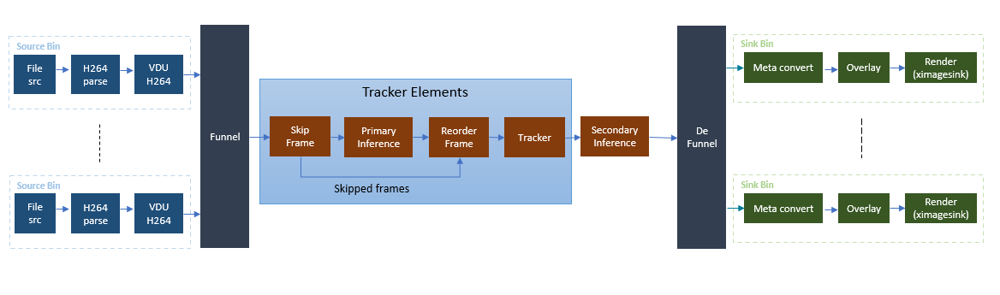

.. _vvas_xtracker:

vvas_xtracker
===============

The tracker plug-in follows detected objects across a sequence of video frames. Since tracking is simpler than detection, tracking algorithms require fewer computational resources than running an object detector on every frame, which makes it useful in many applications.

For each object in the frame, a unique ID is assigned and it is initialized with the coordinates of the object detected by the ML block. The object is extracted from the frame and used as a template. The tracker element then updates its filter every time the object is detected, adapting to any possible changes the object may undergo during the video.

The tracker plug-in provides three types of object tracking algorithms: Intersection-Over-Union **(IOU)**, Kernelized Correlation Filters **(KCF)**, and Minimum Output Sum of Squared Error **(MOSSE)**. The IOU algorithm is used when detection output is available for every frame, while the KCF and MOSSE algorithms are implemented in software and optimized for the host processor.

The tracker plug-in can track up to 16 objects, with the tracker ID starting at 0 and continuing up to MAX_INT32. An ID of -1 is used when the tracker has not yet been assigned an ID.

This pipeline depicts the typical multi-stream usecase where, multiple streams are muxed by funnel element to form a batch for inference.
With tracker in the pipeline, not all the frames are required to be fed for inference. :ref:`vvas_xskipframe` plugin controls the rate at which the frames needs to be sent for inference.
:ref:`vvas_xreorderframe` plugin receives the frames that are inferred and that are skipped and arranges them in the correct order of presentation before forwarding frames downstream.

The frames in the correct order are presented to :ref:`vvas_xtracker` plugin to track the objects that were detected by inference.
Tracker waits for object to be found in multiple frames before assigning Tracker Id to it and attaches the tracked bounding box information in the GstBuffer metadata.

If video resolution is scaled down for tracker, metaaffixer plugin should be added to the pipeline to scale the bounding box co-ordinates received from tracker to original video resolution. 
Metaaffixer scales and updates the Inference metadata to original video resolution and pushes the frames downstream.
Downstream plugins read the bounding box information of the objects from inference metadata attached to the GstBuffer and does further processing.

The :ref:`vvas_xskipframe`, :ref:`vvas_xreorderframe` and :ref:`vvas_xtracker` are multi-stream aware and supports buffers of multiple streams on their sink and source GstPads.

Input and Output
--------------------

Accepts buffers with NV12 color formats on sink and source pads.

Control Parameters and Plugin Properties
---------------------------------------------

The following table lists the GStreamer plugin properties supported by the vvas_xtracker plugin.

Table 8: vvas_xtracker plugin properties

+-----------------------+-------------+---------------+-----------------------+-----------------------+
|                       |             |               |                       |                       |
|  **Property Name**    |   **Type**  | **Range**     |    **Default**        |    **Description**    |
|                       |             |               |                       |                       |
+=======================+=============+===============+=======================+=======================+
| tracker-algo          |   Enum      |   0, 1, 2     |          2            | Tracker algorithm to  |
|                       |             |               |                       | use                   |
|                       |             |               |                       |                       |
|                       |             |               |                       | 0 - Tracker IOU       |
|                       |             |               |                       | algorithm             |
|                       |             |               |                       |                       |
|                       |             |               |                       | 1 - Tracker MOSSE     |
|                       |             |               |                       | algorithm             |
|                       |             |               |                       |                       |
|                       |             |               |                       | 2 - Tracker KCF       |
|                       |             |               |                       | algorithm             |
+-----------------------+-------------+---------------+-----------------------+-----------------------+
| IOU-with-color        |   Boolean   |    0 or 1     |           0           | To use color          |
|                       |             |               |                       | information during    |
|                       |             |               |                       | matching when tracker |
|                       |             |               |                       | algo is IOU           |
|                       |             |               |                       |                       |
|                       |             |               |                       | 0 - No color          |
|                       |             |               |                       | information for       |
|                       |             |               |                       | matching              |
|                       |             |               |                       |                       |
|                       |             |               |                       | 1 - Use color         |
|                       |             |               |                       | information for       |
|                       |             |               |                       | matching              |
+-----------------------+-------------+---------------+-----------------------+-----------------------+
| obj-match-color-space |   Enum      |   0, 1        |          1            | Color space to use    |
|                       |             |               |                       | for objects matching  |
|                       |             |               |                       |                       |
|                       |             |               |                       | 0 - RGB color space   |
|                       |             |               |                       | for object match      |
|                       |             |               |                       |                       |
|                       |             |               |                       | 1 - HSV color space   |
|                       |             |               |                       | for object match      |
+-----------------------+-------------+---------------+-----------------------+-----------------------+
| feature-length        |   Enum      |  22, 31       |         31            | Object feature length |
|                       |             |               |                       | (required only for    |
|                       |             |               |                       | KCF algorithm)        |
+-----------------------+-------------+---------------+-----------------------+-----------------------+
| search-scale          |   Enum      | 0, 1, 2       |         0             | Scales to verify for  |
|                       |             |               |                       | object localization   |
|                       |             |               |                       |                       |
|                       |             |               |                       | 0 - Search all scales |
|                       |             |               |                       | (up, down and same    |
|                       |             |               |                       | scale)                |
|                       |             |               |                       |                       |
|                       |             |               |                       | 1 - Search up and     |
|                       |             |               |                       | same scale            |
|                       |             |               |                       |                       |
|                       |             |               |                       | 2 - Search down and   |
|                       |             |               |                       | same scale            |
+-----------------------+-------------+---------------+-----------------------+-----------------------+
| inactive-wait-        | Integer     |  0 to         |        200            | Number of frames      |
| interval              |             |  4294967295   |                       | to wait before        |
|                       |             |               |                       | stopping tracking of  |
|                       |             |               |                       | inactive objects      |
+-----------------------+-------------+---------------+-----------------------+-----------------------+
| min-object-width      | Integer     |  0 to         |        20             | Minimum object width  |
|                       |             |  4294967295   |                       | in pixels to consider |
|                       |             |               |                       | for tracking          |
+-----------------------+-------------+---------------+-----------------------+-----------------------+
| min-object-height     | Integer     |  0 to         |        60             | Minimum object height |
|                       |             |  4294967295   |                       | in pixels to consider |
|                       |             |               |                       | for tracking          |
+-----------------------+-------------+---------------+-----------------------+-----------------------+
| max-object-width      | Integer     |  0 to         |        200            | Objects width above   |
|                       |             |  4294967295   |                       | maximum width are not |
|                       |             |               |                       | considered for        |
|                       |             |               |                       | tracking              |
+-----------------------+-------------+---------------+-----------------------+-----------------------+
| max-object-height     | Integer     |  0 to         |        360            | Objects height above  |
|                       |             |  4294967295   |                       | maximum height are    |
|                       |             |               |                       | not considered for    |
|                       |             |               |                       | tracking              |
+-----------------------+-------------+---------------+-----------------------+-----------------------+
| num-frames-confidence | Integer     |  0 to         |        3              | Number of times       |
|                       |             |  4294967295   |                       | object need to be     |
|                       |             |               |                       | detected continuously |
|                       |             |               |                       | to consider for       |
|                       |             |               |                       | tracking              |
+-----------------------+-------------+---------------+-----------------------+-----------------------+
| match-search-region   | Float       |  1.0 to 2.0   |        1.5            | Object search region  |
|                       |             |               |                       | during detection for  |
|                       |             |               |                       | IOU based matching    |
+-----------------------+-------------+---------------+-----------------------+-----------------------+
| relative-search-      | Float       |  1.0 to 2.5   |        1.5            | Object search region  |
| region                |             |               |                       | with respect to       |
|                       |             |               |                       | detection coordinates |
+-----------------------+-------------+---------------+-----------------------+-----------------------+
| correlation-threshold | Float       |  0.1 to 1.0   |        0.7            | Object correlation    |
|                       |             |               |                       | threshold value for   |
|                       |             |               |                       | matching              |
+-----------------------+-------------+---------------+-----------------------+-----------------------+
| correlation-weight    | Float       |  0.0 to 1.0   |       0.7             | Weightage for         |
|                       |             |               |                       | correlation value     |
+-----------------------+-------------+---------------+-----------------------+-----------------------+
| overlap-threshold     | Float       | 0.0 to 1.0    |        0              | Object overlap        |
|                       |             |               |                       | threshold to consider |
|                       |             |               |                       | for matching          |
+-----------------------+-------------+---------------+-----------------------+-----------------------+
| overlap-weight        | Float       |  0.0 to 1.0   |       0.2             | Weightage for         |
|                       |             |               |                       | overlap value         |
+-----------------------+-------------+---------------+-----------------------+-----------------------+
| scale-change-         | Float       |  0.001 to 1.0 |        0.7            | Maximum object scale  |
| threshold             |             |               |                       | change threshold to   |
|                       |             |               |                       | consider for matching.|
|                       |             |               |                       | Value of 1 means      |
|                       |             |               |                       | double the scale      |
+-----------------------+-------------+---------------+-----------------------+-----------------------+
| scale-change-weight   | Float       |  0.0 to 1.0   |       0.1             | Weightage for         |
|                       |             |               |                       | change in scale       |
+-----------------------+-------------+---------------+-----------------------+-----------------------+
| occlusion-threshold   | Float       |  0.0 to 1.0   |       0.4             | Threshold for         |
|                       |             |               |                       | considering object as |
|                       |             |               |                       | occluded              |
+-----------------------+-------------+---------------+-----------------------+-----------------------+
| confidence-score-     | Float       |  0.0 to 1.0   |       0.25            | Confidence score of   |
| threshold             |             |               |                       | tracker to be         |
|                       |             |               |                       | consider for tracking |
|                       |             |               |                       | objects               |
+-----------------------+-------------+---------------+-----------------------+-----------------------+
| skip-inactive-objs    | Boolean     |  0 or 1       |       0               | Whether to mark the   |
|                       |             |               |                       | inactive tracker      |
|                       |             |               |                       | objects to be skipped |
|                       |             |               |                       | by downstream plugins |
|                       |             |               |                       | or not.               |
|                       |             |               |                       |                       |
|                       |             |               |                       | 0 - Inactive objects  |
|                       |             |               |                       | are processed by      |
|                       |             |               |                       | downstream plugins    |
|                       |             |               |                       |                       |
|                       |             |               |                       | 1 - Inactive objects  |
|                       |             |               |                       | marked not to be      |
|                       |             |               |                       | processed by          |
|                       |             |               |                       | downstream plugins    |
+-----------------------+-------------+---------------+-----------------------+-----------------------+

Example Pipeline
-----------------

The following is an example pipeline to demonstrate usage of vvas_xtracker plugin with inference performed every 6th frame.
The entry 'label-filter' in configuration file - '/opt/xilinx/examples/jsons/hw_imgproc/metaconvert.json' can be changed from
"label-filter" : [ "class"] to "label-filter" : [ "class", "tracker-id" ] so that tracked id of the detected object can be seen
in the label for that object.

.. code-block::

   gst-launch-1.0 -v \
   filesrc location=/opt/xilinx/examples/Videos/Cars_1900.264 ! \
   h264parse ! \
   queue ! \
   vvas_xvideodec kernel-name=kernel_vdu_decoder:{kernel_vdu_decoder_0} instance-id=0 \
   xclbin-location=/opt/xilinx/xclbin/v70.xclbin dev-idx=0 avoid-output-copy=false avoid-dynamic-alloc=0 additional-output-buffers=10 ! \
   queue ! \
   identity sync=0 ! \
   vvas_xfunnel name=vvas_xfunnel_vcudec_0_0 ! \
   vvas_xskipframe name=skip_0_0 infer-interval=6 ! \
   vvas_xinfer preprocess-config=/opt/xilinx/examples/jsons/hw_imgproc/ppe_yolov3_voc_imgproc0.json \
   infer-config=/opt/xilinx/examples/jsons/hw_imgproc/infer_yolov3_voc.json name=yolo_0 ! \
   queue max-size-bytes=0 max-size-buffers=1 max-size-time=0 ! \
   vvas_xreorderframe name=reorder_0_0 ! \
   queue max-size-bytes=0 max-size-buffers=1 max-size-time=0 ! \
   vvas_xtracker tracker-algo=2 min-object-width=20 max-object-width=1900 min-object-height=20 max-object-height=1000 \
   match-search-region=1 num-frames-confidence=2 skip-inactive-objs=true ! \
   queue max-size-bytes=0 max-size-buffers=1 max-size-time=0 ! \
   vvas_xdefunnel name=devvas_xfunnel_vcudec_0_0 skip_0_0. ! \
   reorder_0_0. devvas_xfunnel_vcudec_0_0. ! \
   queue max-size-bytes=0 max-size-buffers=4 max-size-time=0 ! \
   vvas_xmetaconvert config-location=/opt/xilinx/examples/jsons/hw_imgproc/metaconvert.json ! \
   queue max-size-bytes=0 max-size-buffers=1 max-size-time=0 ! \
   vvas_xoverlay ! queue max-size-bytes=0 max-size-buffers=1 max-size-time=0 ! \
   videoconvert ! \
   queue ! \
   fpsdisplaysink name=perf_0 video-sink="filesink location=out_gst_car.nv12" text-overlay=false sync=false fps-update-interval=5000

..
  ------------
  MIT License

  Copyright (c) 2023 Advanced Micro Devices, Inc.

  Permission is hereby granted, free of charge, to any person obtaining a copy of this software and associated documentation files (the "Software"), to deal in the Software without restriction, including without limitation the rights to use, copy, modify, merge, publish, distribute, sublicense, and/or sell copies of the Software, and to permit persons to whom the Software is furnished to do so, subject to the following conditions:

  The above copyright notice and this permission notice (including the next paragraph) shall be included in all copies or substantial portions of the Software.

  THE SOFTWARE IS PROVIDED "AS IS", WITHOUT WARRANTY OF ANY KIND, EXPRESS OR IMPLIED, INCLUDING BUT NOT LIMITED TO THE WARRANTIES OF MERCHANTABILITY, FITNESS FOR A PARTICULAR PURPOSE AND NONINFRINGEMENT. IN NO EVENT SHALL THE AUTHORS OR COPYRIGHT HOLDERS BE LIABLE FOR ANY CLAIM, DAMAGES OR OTHER LIABILITY, WHETHER IN AN ACTION OF CONTRACT, TORT OR OTHERWISE, ARISING FROM, OUT OF OR IN CONNECTION WITH THE SOFTWARE OR THE USE OR OTHER DEALINGS IN THE SOFTWARE.
